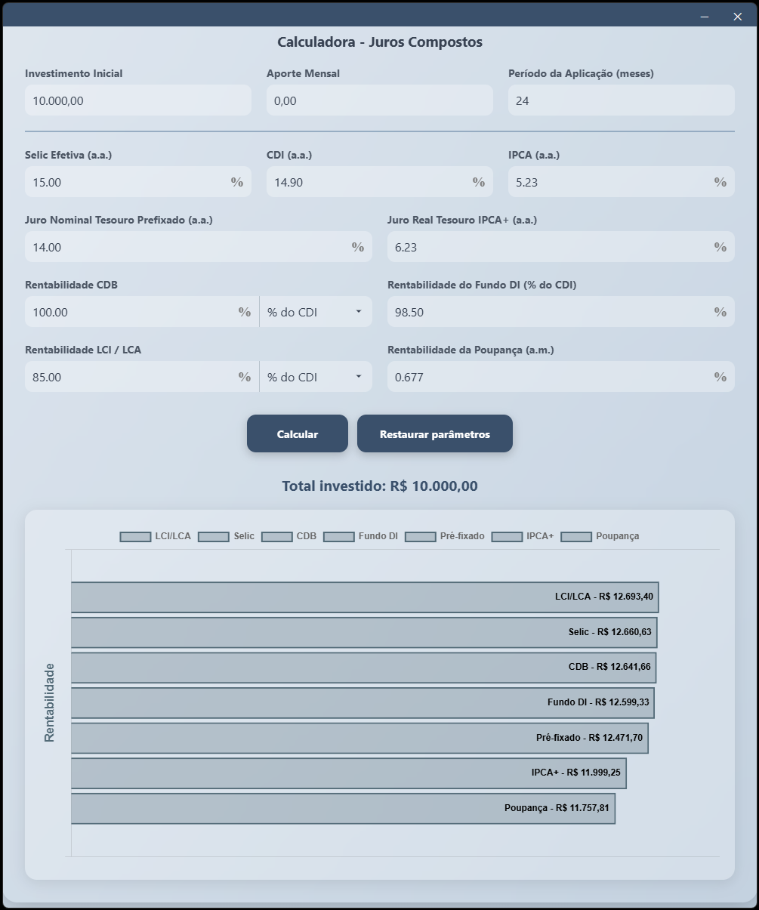
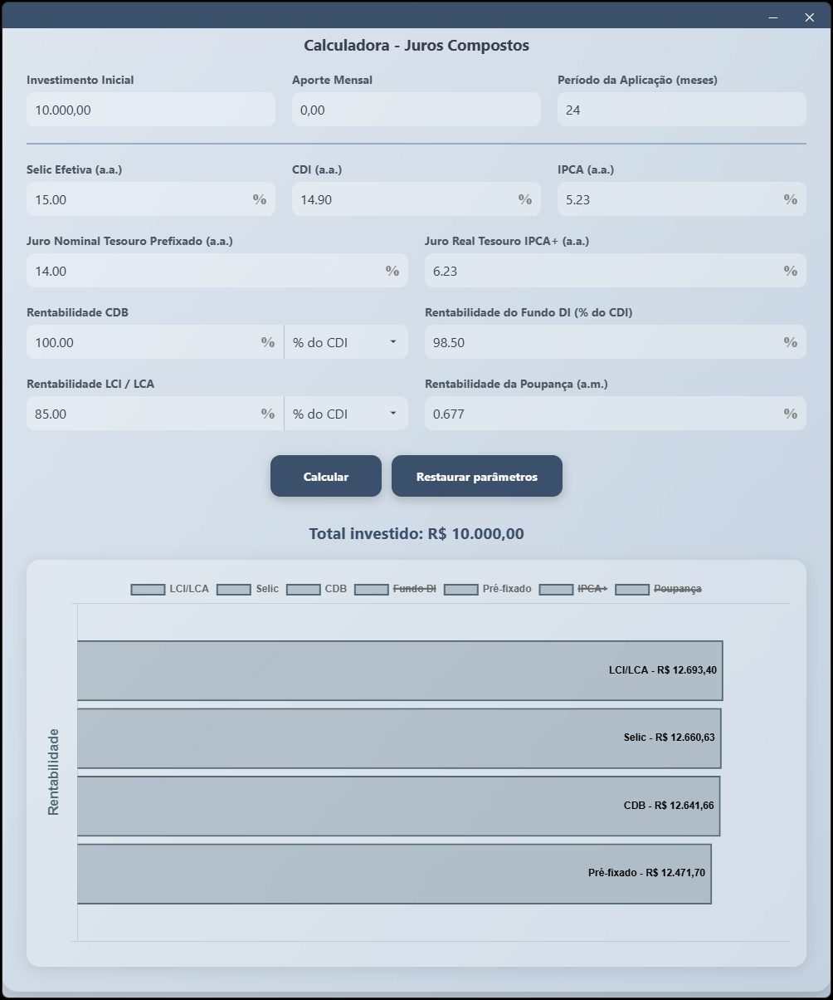

# 📈 Calculadora - Juros Compostos

Aplicação responsável por simular a rentabilidade líquida de diferentes tipos de investimentos com base em valores aportados, tempo de aplicação e taxas informadas.


## 📋 Dependências

```
ElectronJS
Chart.js
Chart.js DataLabels Plugin
```

### 📊 Taxas

Taxas configuráveis:

```
Selic (a.a.)
CDI (a.a.)
IPCA (a.a.)
Prefixado (a.a.)
IPCA+ (a.a.)
CDB (% do CDI, IPCA ou Prefixado)
Fundo DI (% do CDI)
LCI/LCA (% do CDI, IPCA ou Prefixado)
Poupança (a.m.)
```

### 🔄 Atualização de Dados

Os dados dos principais índices econômicos são **obtidos dinamicamente via API do Banco Central do Brasil**, garantindo que as simulações reflitam os valores mais recentes disponíveis.

Índices atualizados:

- Selic  
- CDI  
- IPCA  
- Poupança 

### 📤 Saída

O sistema calcula e exibe a rentabilidade líquida para cada tipo de investimento de forma comparativa em um **gráfico horizontal de barras**.

#### Exemplo de visualização



É possível limitar o gráfico clicando nas legendas (retângulos) de cada índice. Assim, você pode focar apenas nos investimentos desejados.



## 🧮 Cálculo

A simulação é feita com **juros compostos mensais**, considerando os aportes mensais e as taxas convertidas para o mesmo período (mensal ou anual conforme aplicável). Os valores exibidos são **líquidos**, considerando possíveis tributações ou regras específicas por tipo de investimento.

## ✅ Exemplo de uso

1. Preencha os valores desejados nos campos.
2. Clique em **"Calcular"**.
3. Visualize o gráfico com os valores finais de cada tipo de aplicação.
4. Utilize o botão **"Restaurar parâmetros"** para limpar os campos e simular novamente.

## 🛠️ Construído com

* [ElectronJS](https://www.electronjs.org/pt/)
* [Chart.js](https://www.chartjs.org/)
* [Chart.js DataLabels](https://chartjs-plugin-datalabels.netlify.app/)
* [JavaScript](https://developer.mozilla.org/en-US/docs/Web/JavaScript)
* [HTML5](https://developer.mozilla.org/en-US/docs/Web/Guide/HTML/HTML5)
* [CSS3](https://developer.mozilla.org/en-US/docs/Web/CSS)

## 📌 Versão

V1.0.0

## ✒️ Autor

* **Desenvolvedor** - *Implementação & Interface* - [Victor Nikolaus](https://github.com/vnikolaus)
